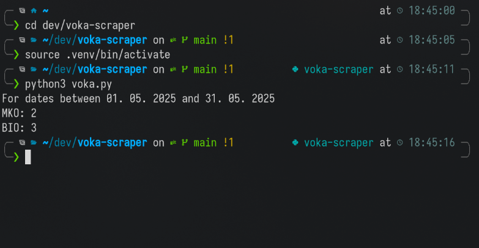

# voka-scraper

Scraper for VoKa underground garbage cans



## 🗑️ Dumpings

To quote the VoKa's webpage at <https://www.mojiodpadki.si/odpadki/podzemne-zbiralnice>, the fixed dumpings included in the price are:

BIO: 8x
MKO: 6x

The price for extra BIO dumping is 0.1335 EUR and for MKO dumping 2.4809 EUR.

Note that BIO is Biological trash and MKO is Mixed trash (mešani komunalni odpadki).

The following was taken from the website on 2. 6. 2025, so the current prices may be higher!

```txt
Cena enega vnosa preostanka odpadkov je 2,4809 €, cena enega vnosa BIO odpadkov pa 0,1335 €. Mesečni strošek za ravnanje z odpadki za štirinajst minimalnih vnosov (šestkrat preostanek odpadkov in osemkrat BIO odpadki) skupaj z DDV znaša 15,95 €.
```

## 🐳 Running the app using Docker

Create a docker container using:

```bash
docker build -t voka-scraper .
```

Then simply run the container using this command:

```bash
docker run --rm voka-scraper
```

You should, of course, override individual config settings using the following command syntax:

```bash
docker run --rm -e date_from='01.01.2025' -e date_to='31.01.2025' -e chip_card_number='{your_chip_card_number} -e password='{your_chip_card_password}' voka-scraper
```
